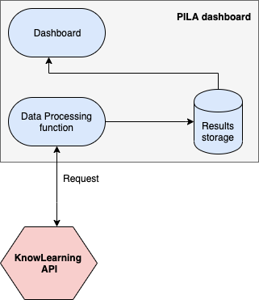
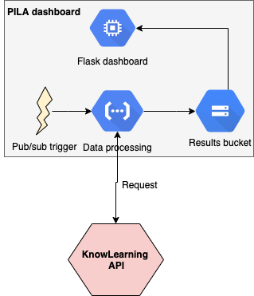

# PILA dashboard

[Current preview of Karel](https://chrispiech.github.io/pisaPrototype/)

The diagram below presents a high-level overview of the proposed **Dashboard**. A loosely coupled architecture ensures system reliability in case of failures along the pipeline. The system is composed of three components:
 - a **Data Processing** service that i) pulls data from KnowLearning, ii) processes them and iii) stores them in a bucket;
 - a **Storage** service where final results could be stored;
 - a **Dashboard** that presents the final results;

The working assumption is that there is no need to display real-time data. That would require a different architecture (e.g. a streaming service and a database).

This system could be implemented on Google Cloud Platform as shown in the diagram below. The **Data Processing** service could be configured as a *Cloud Function* with either an event-driven or a pub/sub trigger (e.g. hourly updates). Google *Cloud Storage* buckets could provide the storage service and the **Dashboard** (possibly developed in Flask) could be hosted on a *Compute Engine* instance.

